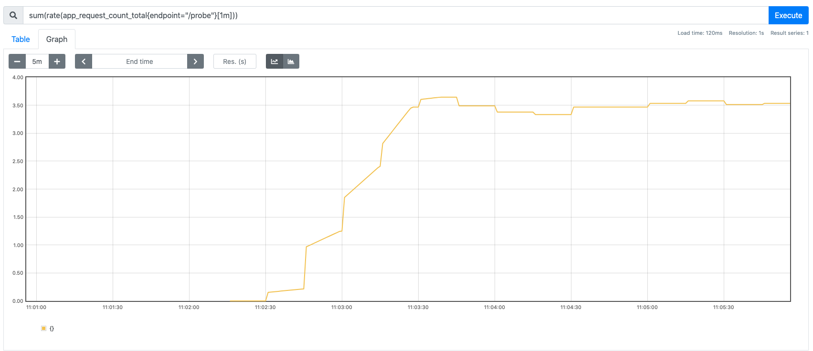
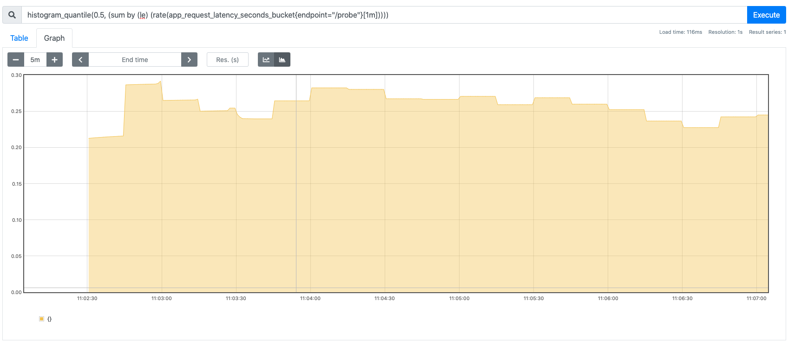

Посмотреть метрики можно с помощью языка запросов PromQL на [дашборде](https://[[HOST_SUBDOMAIN]]-9090-[[KATACODA_HOST]].environments.katacoda.com/graph).

Для того, чтобы видеть изменения в метриках, необходимо нагрузить сервис с помощью команды:

`
load.sh`{{execute}}

Посмотрите, как выглядят на самом деле метрики:

Если Вы введёте метрику в Execute, то увидите все временные ряды, которые есть в этой метрике.

Например, метрика app_request_count_total представляет собой несколько временных рядов, но поскольку метрика имеет тип счётчик, то значение метрики является монотонно растущим и это можно увидеть на графиках:

Отфильтруйте и посмотрите запросы только для сервиса /probe:

`app_request_count_total{endpoint="/probe"}`{{copy}}

С помощью функции rate можно вычислить RPS — количество запросов в секунду:

`rate(app_request_count_total{endpoint="/probe"}[1m])`{{copy}}

Если необходим общий RPS, без разбивки по отличающимся метками, нужно суммировать RPS:

`sum(rate(app_request_count_total{endpoint="/probe"}[1m]))`{{copy}}

В среднем получается где-то три запроса в секунду.

Важно понимать, что значение точки на графике — это не моментальное значение RPS, а среднее значение за какой-то период (1m, 5m и т.д.) в данный момент времени. И чем больше этот период, тем более гладким будет график.

Попробуйте посчитать квантили по времени ответа. Для этого необходимо воспользоваться метрикой app_request_latency_seconds_bucket:

Посчитать медианное значение времени ответа можно с помощью запроса:

`histogram_quantile(0.5, (sum by (le) (rate(app_request_latency_seconds_bucket{endpoint="/probe"}[1m]))))`{{copy}}

В среднем получается медианное время ответа — 250 миллисекунд.
