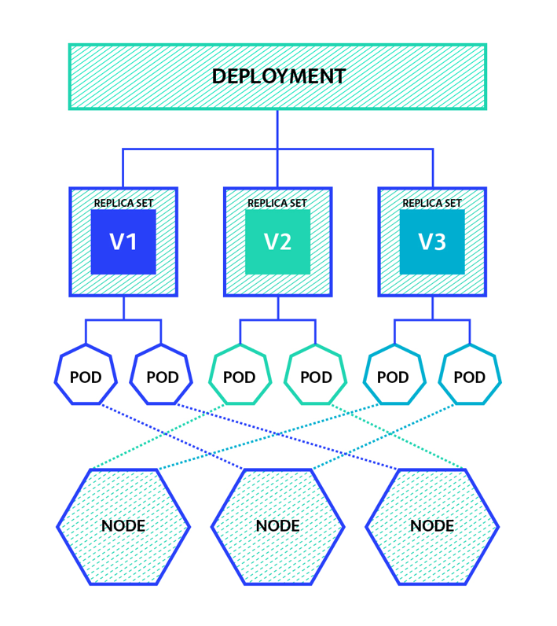

Стратегия развертывания **Kubernetes** определяет процедуры создания, обновления и понижения версий приложений **Kubernetes**. В традиционной программной среде развертывание или обновление приложений часто приводит к сбоям и простоям в работе. **Kubernetes** помогает избежать простоев, предоставляя различные стратегии развертывания, которые позволяют выполнять скользящие обновления на нескольких экземплярах приложений.
Стратегии развертывания **Kubernetes** поддерживают различные требования к разработке и развертыванию приложений. Каждая стратегия развертывания **Kubernetes** имеет свои преимущества, поэтому выбор подходящей стратегии зависит только от конкретных потребностей и целей.
Важно понимать, что по умолчанию в **Kubernetes** встроены только стратегии развертывания **RollingUpdate** и **Recreate**. Но и другие типы развертываний можно выполнить в **Kubernetes**, для этого потребуется выполнить дополнительные настройки или использовать специализированный инструментарий.

## Стратегия обновления RollingUpdate



Теперь давайте посмотрим, как работают *стратегии обновления*. В текущем манифесте используется **RollingUpdate**. Давайте обновим версию в манифесте на **v2**

<pre class="file" data-filename="./deployment.yaml" data-target="insert" data-marker="          image: schetinnikov/hello-app:v1">
          image: schetinnikov/hello-app:v2</pre>

И применим манифест

`kubectl apply -f deployment.yaml`{{execute T1}}

Во второй вкладке можем наблюдать за тем, как одновременно создаются и удаляются *поды*.

```

NAME                                READY   STATUS        RESTARTS   AGE
hello-deployment-6949477748-2b9wj   1/1     Running       0          6s
hello-deployment-6949477748-8hl8n   1/1     Running       0          10s
hello-deployment-6949477748-zp49n   1/1     Running       0          4s
hello-deployment-d67cff5cc-2vpkg    1/1     Terminating   0          3m28s
hello-deployment-d67cff5cc-hrfh8    1/1     Terminating   0          7m34s
hello-deployment-d67cff5cc-hsf6g    1/1     Terminating   0          7m34s
```

Также мы можем откатить *деплоймент*. Для этого достаточно вернуть версию назад.

<pre class="file" data-filename="./deployment.yaml" data-target="insert" data-marker="          image: schetinnikov/hello-app:v2">
          image: schetinnikov/hello-app:v1</pre>

И применить манифест 

`kubectl apply -f deployment.yaml`{{execute T1}}

Во второй вкладке можем наблюдать за тем, как одновременно создаются и удаляются поды. 

```
NAME                                READY   STATUS              RESTARTS   AGE
hello-deployment-6949477748-2b9wj   1/1     Terminating         0          45s
hello-deployment-6949477748-8hl8n   1/1     Running             0          49s
hello-deployment-6949477748-zp49n   1/1     Terminating         0          43s
hello-deployment-d67cff5cc-ssnlk    1/1     Running             0          3s
hello-deployment-d67cff5cc-swdqh    1/1     Running             0          5s
hello-deployment-d67cff5cc-vbkl7    0/1     ContainerCreating   0          1s
```

Дождемся пока *деплоймент* полностью откатится.

## Обновление деплоймента с помощью kubectl set image и kubectl rollout undo

Мы также можем обновить версию *деплоймента* и откатить его с помощью *императивных* команд **kubectl**. 

Для обновления на новую версию можно использовать **kubectl set image**:

`kubectl set image deploy/hello-deployment hello-demo=schetinnikov/hello-app:v2`{{execute T1}}

А чтобы откатить **kubect rollout undo**:

`kubectl rollout undo deploy/hello-deployment`{{execute T1}}

## Стратегия обновления Recreate

Теперь посмотрим, как работает стратегия **Recreate**

Правим манифест

<pre class="file" data-filename="./deployment.yaml" data-target="insert" data-marker="    type: RollingUpdate">
    type: Recreate</pre>

и обновляем версию 

<pre class="file" data-filename="./deployment.yaml" data-target="insert" data-marker="          image: schetinnikov/hello-app:v1">
          image: schetinnikov/hello-app:v2</pre>

Применяем манифест. 

`kubectl apply -f deployment.yaml`{{execute T1}}

Во второй вкладке можем наблюдать за тем, как одновременно сначала все *поды* находятся в статусе **Terminating**:
```
NAME                                READY   STATUS        RESTARTS   AGE
hello-deployment-6949477748-6w8g4   1/1     Terminating   0          6m39s
hello-deployment-6949477748-s8fqw   1/1     Terminating   0          6m41s
hello-deployment-6949477748-vjsgg   1/1     Terminating   0          6m44s
```

А после их завершения, создаются новые:
```
NAME                               READY   STATUS    RESTARTS   AGE
hello-deployment-d67cff5cc-5cq94   1/1     Running   0          5s
hello-deployment-d67cff5cc-7p2cv   1/1     Running   0          5s
hello-deployment-d67cff5cc-z54rr   1/1     Running   0          5s
```

## Удаление деплоймента

Теперь можем удалить *деплоймент*:

`kubectl delete -f deployment.yaml`{{execute T1}}

Вместе с удалением *деплоймента* будут удалены все *поды*.

