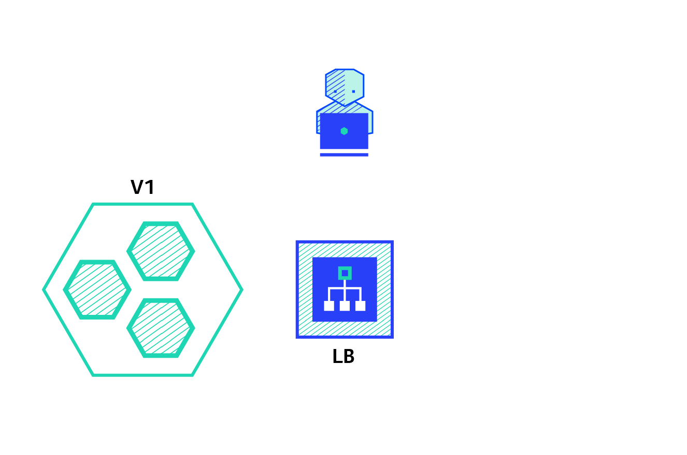

Стратегия развёртывания Kubernetes определяет процедуры создания, обновления и понижения версий приложений Kubernetes. В традиционной программной среде развёртывание или обновление приложений часто приводит к сбоям и простоям в работе. Kubernetes помогает избежать простоев, предоставляя различные стратегии развёртывания, которые позволяют выполнять скользящие обновления на нескольких экземплярах приложений. Стратегии развёртывания Kubernetes поддерживают различные требования к разработке и развёртыванию приложений. Каждая стратегия развёртывания Kubernetes имеет свои преимущества, поэтому выбор подходящей стратегии зависит только от конкретных потребностей и целей. Важно понимать, что по умолчанию в Kubernetes встроены только стратегии развёртывания **RollingUpdate** и **Recreate**. Но и другие типы развёртываний можно выполнить в Kubernetes, для этого потребуется выполнить дополнительные настройки или использовать специализированный инструментарий.

Давайте посмотрим, как работают стратегии развёртывания.

## Стратегия обновления RollingUpdate (Ramped)
Данная стратегия постепенного развёртывания заключается в медленном развёртывании новой версии приложения путем поочередной замены экземпляров до тех пор, пока не будут развёрнуты необходимое количество экземпляров с новой версией приложения. Обычно это происходит следующим образом: на базе пула версии A за балансировщиком нагрузки разворачивается один экземпляр версии B. Когда сервис готов к приёму трафика, экземпляр добавляется в пул. Затем один экземпляр версии A удаляется из пула и выключается.

Стратегия скользящего обновления обеспечивает плавный инкрементный переход от старой версии приложения к новой. Когда запускается новый набор реплик, содержащий новую версию, реплики старой версии завершаются. В конечном итоге все поды старой версии завершаются и заменяются поды новой версии. Данная стратегия используется в Kubernetes по умолчанию.

В текущем манифесте используется **RollingUpdate**. Обновите версию в манифесте на **v2**:

<pre class="file" data-filename="./deployment.yaml" data-target="insert" data-marker="          image: schetinnikov/hello-app:v1">
image: schetinnikov/hello-app:v2</pre>

Примените манифест:

`kubectl apply -f deployment.yaml`{{execute T1}}

Состояние развёртывания можно получить с помощью команд:

`kubectl get deploy hello-deployment `{{execute T1}}

Для просмотра более подробных сведений о текущей версии приложения в запущенных подах, выполните команду:

`kubectl describe deploy hello-deployment`{{execute T1}}

Получили информацию об образе:
`Image: shetinnikov/hello-app:v2`

Если необходимо, можно откатиться к предыдущей версии развертывания. Для этого достаточно вернуть версию назад:

<pre class="file" data-filename="./deployment.yaml" data-target="insert" data-marker="          image: schetinnikov/hello-app:v2">
image: schetinnikov/hello-app:v1</pre>

Примените манифест: 

`kubectl apply -f deployment.yaml`{{execute T1}}

Состояние развёртывания можно получить с помощью команд:

`kubectl get deploy hello-deployment `{{execute T1}}

Дождитесь пока выполнение операции полностью откатится.

Для просмотра более подробных сведений о текущей версии приложения в запущенных подов, выполните команду:

`kubectl describe deploy hello-deployment`{{execute T1}}

Получили следующую информацию об образе:
`Image: shetinnikov/hello-app:v1`

## Обновление развёртывания с помощью kubectl set image и kubectl rollout undo

Обновить версию развёртывания и откатить его можно с помощью императивных команд **kubectl**.

Для обновления на новую версию можно использовать **kubectl set image**:

`kubectl set image deploy/hello-deployment hello-demo=schetinnikov/hello-app:v2`{{execute T1}}

Чтобы откатить версию можно использовать **kubect rollout undo**:

`kubectl rollout undo deploy/hello-deployment`{{execute T1}}

В зависимости от системы, обеспечивающей постепенное развёртывание, можно изменить следующие параметры для сокращения времени развёртывания:

- **Parallelism, max batch size**: количество одновременно развёртываемых экземпляров.
- **Max surge**: количество экземпляров, которое может быть создано в дополнение к заданному количеству при развёртывании.
- **Max unavailable**: количество недоступных экземпляров во время процедуры скользящего обновления.

## Выводы о стратегии обновления RollingUpdate (Ramped)
**Плюсы:**
- Простота настройки.
- Постепенное распространение версий по всем экземплярам.
- Удобно для приложений с состоянием, которые обеспечивают перераспределение данных.

**Минусы:**
- Откат/переход может занимать время.
- Поддержка нескольких API затруднена.
- Отсутствие контроля над трафиком.

## Стратегия обновления Recreate

Теперь рассмотрим, как работает стратегия **Recreate**. Это самый простой тип развёртывания Kubernetes, который заключается в прекращении работы старых версий и последующем развёртывании новых. Эта стратегия оказывает наибольшее влияние на пользователей и приводит к перебоям в работе. Кроме того, откат к предыдущей версии при необходимости занимает больше всего времени, но не требует настройки и специальных знаний от инженеров.

Стратегия воссоздания используется для систем, которые не могут функционировать в частично обновлённом состоянии, или если лучше иметь время простоя, чем предоставлять пользователям менее качественные услуги. Чем крупнее обновление, тем больше вероятность того, что при скользящем обновлении возникнет ошибка. Поэтому для больших обновлений и модернизаций лучше использовать стратегию воссоздания.

Для внесения правок в манифест, выполните команду:

<pre class="file" data-filename="./deployment.yaml" data-target="insert" data-marker="    type: RollingUpdate">
type: Recreate</pre>

Обновите версию:

<pre class="file" data-filename="./deployment.yaml" data-target="insert" data-marker="          image: schetinnikov/hello-app:v1">
image: schetinnikov/hello-app:v2</pre>

Примените манифест:

`kubectl apply -f deployment.yaml`{{execute T1}}

Состояние развёртывания можно получить с помощью команды:

`kubectl get deploy hello-deployment `{{execute T1}}

## Удаление Deployment

Теперь можно удалить Deployment:

`kubectl delete -f deployment.yaml`{{execute T1}}

Вместе с удалением Deployment будут удалены все поды.

## Выводы о стратегии обновления Recreate

**Плюсы:**
- Простота настройки.
- Полностью обновлённое состояние приложения.

**Минусы:**
- Высокий эффект на пользователя, время простоя зависит от продолжительности выключения и загрузки приложения.

