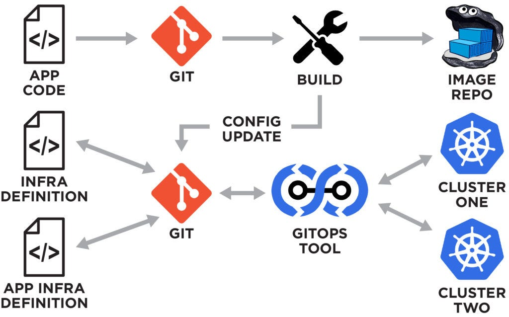

## GitOps

GitOps - это набор принципов организации операционных процессов управления и эксплуатации программными системами.

При использовании GitOps _желаемое состояние_ системы или подсистемы определяется декларативно в виде версионных неизменяемых данных, хранимых в системах контроля версии (Git), а конфигурация работающей системы постоянно формируется на основе этих данных.

Эти принципы были заимствованы из современных подходов к управлению операционным процессом, но в основе их лежат уже существующие и широко распространенные лучшие практики.

## Принципы GitOps

1. **Принцип декларативности желаемого состояния**

    Система, управляемая GitOps, должна иметь свое _желаемое состояние_, выраженное декларативно в виде данных в формате, доступном для записи и чтения как людьми, так и машинами.

2. **Принцип неизменяемости желаемых вариантов состояния**

    _Желаемое состояние_ должно храниться таким образом, чтобы поддерживать версионность, неизменяемость версий и сохранять полную историю версий.

3. **Принцип непрерывности согласования состояний**

    Программные агенты непрерывно и автоматически сравнивают _актуальное состояние_ системы с ее _желаемым состоянием_.
    Если фактическое и желаемое состояния по каким-либо причинам расходятся, инициируются автоматические действия по их согласованию.

GitOps - это способ реализации непрерывного развертывания для облачных приложений. Он сфокусирован на работу с инфраструктурой, привычным для разаработчиков подходом, с использованием уже знакомых им инструментов, включая Git и средства непрерывного развертывания.

Основная идея GitOps заключается в наличии Git-репозитория, который всегда содержит декларативные описания инфраструктуры, необходимой в данный момент в производственной среде, и автоматизированного процесса приведения производственной среды в соответствие с описанным в репозитории состоянием. Если необходимо развернуть новое приложение или обновить существующее, достаточно обновить репозиторий - все остальное сделает автоматический процесс. Это похоже на круиз-контроль для управления производственными приложениями.