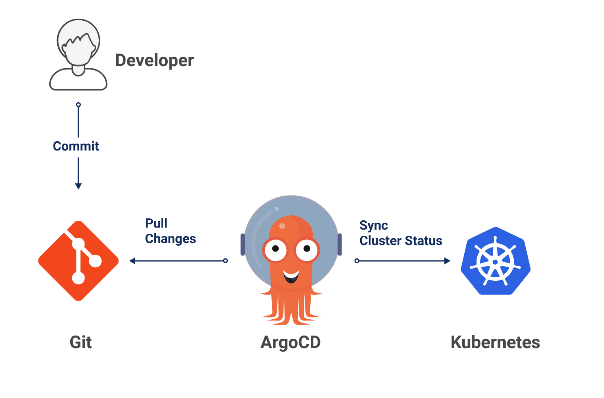
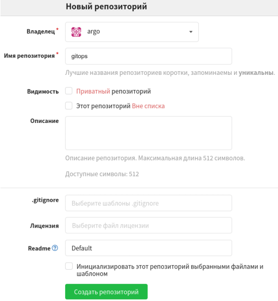

## Настройка окружения для GitOPS

Для подготовки окружения запустите скрипт: 

`prepare.sh`{{execute}}

Скрипт выполняет следующее:
- создаёт файл переменных окружения ~/envs;
- выполняет установку системных компонент Gogs, ArgoCD.

Дождитесь пока все компоненты будут успешно инсталлированы (3-5 мин). 

## Компонент Gogs

Важным компонентом подхода GitOPS является сервис контроля версий Git, в котором совместно хранятся исходный код приложения, а также другие манифесты и конфигурационные файлы, необходимые для запуска приложения в среде Kubernetes. В качестве учебного примера такого сервиса мы будем использовать решение **Gogs** (https://gogs.io/). **Gogs** является легковесным open source аналогом GitHub.  

## Компонент Argo CD

Одним из популярных инструментов, используемых в GitOPS является **Argo CD**.


**Argo CD** — это инструмент непрерывного развёртывания (CD), ориентированный на Kubernetes. В отличие от внешних CD-инструментов, обеспечивающих только push-развёртывание, **Argo CD** может отслеживать, автоматически извлекать обновлённый код из Git-репозиториев и разворачивать его непосредственно на ресурсах Kubernetes. Это позволяет разработчикам управлять как конфигурацией инфраструктуры, так и обновлениями приложений в одной системе.

Когда происходит фиксация (обычно обновляющие версии артефактов образа), **Argo CD** запускает процесс «синхронизации», который отвечает за приведение конфигурации кластера в то же состояние, как описано в Git.

Когда процесс синхронизации завершён, мы знаем, что конфигурация приложения точно такая же, как в манифестах Git.

Несмотря на то, что процесс синхронизации жизненно важен для выполнения первоначального развёртывания приложения, одной из сильных сторон **Argo CD** является непрерывный мониторинг обоих состояний (кластера и Git) после развертывания. Этот непрерывный мониторинг очень важен для решения проблемы дрейфа конфигурации, который является очень распространенной проблемой в организациях с большим количеством целей развёртывания.

## Проверка деплойментов
После завершения работы скрипта получите список запущенных подов в кластере и убедитесь, что у всех статус Running:

`kubectl get po -A  | grep -v Complete`{{execute}}

## Настройка репозитория
После проверки откройте [web-интерфейс gogs](https://[[HOST_SUBDOMAIN]]-32100-[[KATACODA_HOST]].environments.katacoda.com/gogs/) 

Нажмите кнопку «Регистрация» в верхнем правом углу интерфейса gogs и зарегистрируйтесь:
Имя пользователя — argo;
Эл. почта — произвольно, в формате почтового адреса;
Пароль — произвольно, можно такой же как имя.

  

Далее создайте тестовый репозиторий **gitops**  

 

Для подготовки репозитория запустите скрипт ниже. Он добавит в него локально расположенные файлы с настройками.  
`~/prepare_repo.sh`{{execute}}  

Скрипт попросит имя/пароль зарегистрированного в gogs пользователя, укажите их. 
```shell
Writing objects: 100% (3/3), 850 bytes | 850.00 KiB/s, done.
Total 3 (delta 0), reused 0 (delta 0)
Username for 'http://localhost:32100': argo
Password for 'http://argo@localhost:32100': 
To http://localhost:32100/argo/gitops
 * [new branch]      HEAD -> master
```

Откройте заново страницу с репозиторием и убедитесь, что в нём появилась директория app и файл с развёртыванием тестового приложения.

На этом настройка сервиса Git репозитория для хранения исходного кода приложения завершена.

После успешного запуска всех компонентов **Argo CD** необходимо подключить новый проект для отслеживания. Для этого выполните следующую команду: 
`kubectl apply -n argocd -f argocd-project.yaml`{{execute}}

На этом предварительная настройка окружения завершена.